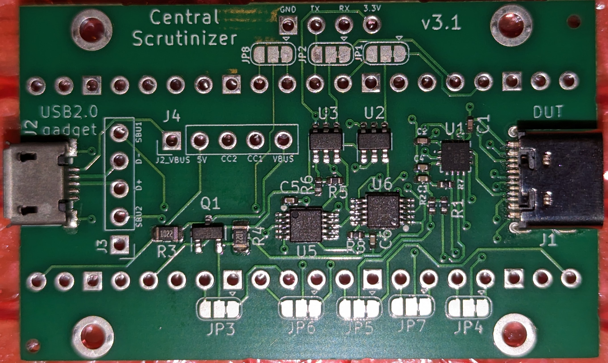
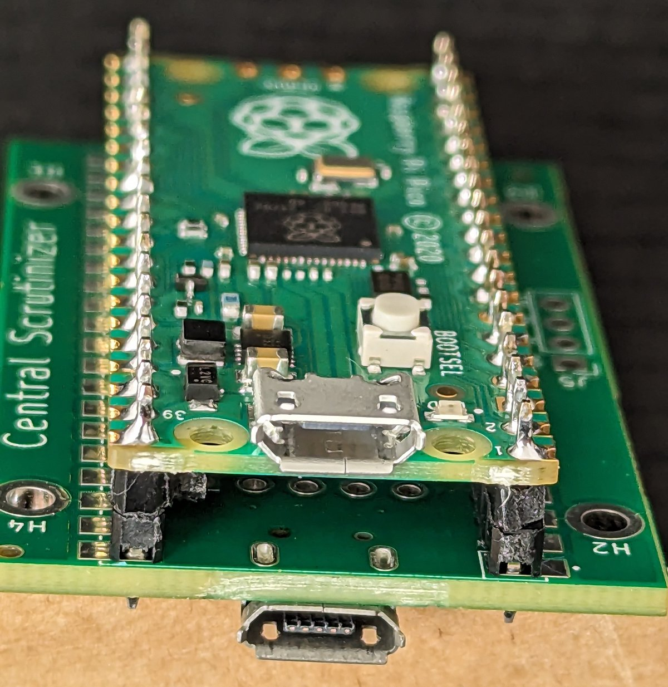

Taken from the original Developer Quickstart guide

## Getting a serial console

Having a serial console is indispensable for a fast development cycle and to debug low-level issues.

M1 Macs expose their debug serial port over one of their Type C ports (the same one used for DFU). On MacBooks, this is the rear left port. On the Mac Mini, this is the port closest to the power plug.

The target machine can also be hard-rebooted using USB-PD VDM commands, making for a quick test cycle (no holding down power buttons).

See [USB-PD](usb-pd.md) for details on the USB-PD VDM commands and what you can do with them.

The serial port is a UART using 1.2V logic levels, and requires vendor-specific USB-PD VDM commands to enable. Thus, making a compatible cable is nontrivial. You have the following options.

### Using an M1 machine

If you have two M1 boxes, this is the simplest solution. Just grab [macvdmtool](https://github.com/AsahiLinux/macvdmtool/), connect both machines with a standard Type C SuperSpeed cable using the DFU port on *both* machines, and that's it!

**IMPORTANT NOTE:** The cable needs to be the USB 3 / SuperSpeed type. USB 2 only cables won't work, **the charging cable that comes with the MacBook/MacBook Air will not work** and neither will most other cheap cables or cables marketed for their charging capacity. If it doesn't say "SuperSpeed" or "USB3.0" in the package it almost certainly won't work. If it's thin and bendy it is almost certainly *not* a SuperSpeed cable. Cables that work need to have upwards of **15** wires inside them; if it doesn't feel like it could possibly have that many wires inside, it is not the cable you need. If you are sure your cable is SuperSpeed capable (i.e. devices do enumerate as SuperSpeed through it) and it still doesn't work, then it is non-compliant and the manufacturer deserves to be shamed on their Amazon reviews page, because it means they didn't connect the SBU1/2 pins.

```shell
$ xcode-select --install
$ git clone https://github.com/AsahiLinux/macvdmtool
$ cd macvdmtool
$ make
$ sudo ./macvdmtool reboot serial
```

You should see something like this:

```
Mac type: J313AP
Looking for HPM devices...
Found: IOService:/AppleARMPE/arm-io@10F00000/AppleT810xIO/i2c0@35010000/AppleS5L8940XI2CController/hpmBusManager@6B/AppleHPMBusController/hpm0/AppleHPMARM
Connection: Sink
Status: APP 
Unlocking... OK
Entering DBMa mode... Status: DBMa
Rebooting target into normal mode... OK
Waiting for connection........ Connected
Putting target into serial mode... OK
Putting local end into serial mode... OK
Exiting DBMa mode... OK
```

See the macvdmtool page or just run it without arguments for a list of supported commands. Your serial port device is `/dev/cu.debug-console`. You can try picocom with: `sudo picocom -q --omap crlf --imap lfcrlf -b 115200 /dev/tty.debug-console`.


NOTE: if you have enabled serial debug output on your host machine (via nvram settings), the serial port device will be in use by the kernel. You need to turn that off to use it as a generic serial port.

### DIY Arduino-based USB-PD interface

You can build a DIY USB-PD interface with the following parts:

* An Arduino or clone
* An FUSB302 chip, either stand-alone or on a breakout board
* A USB Type C breakout board (get a male one, plugging in directly into the target, for the most flexibility)
* A 1.2V compatible UART interface

Note that most FUSB302 breakout boards will not usefully break out the Type C pins you need, so it's best to use a separate full breakout board.

Go to the [vdmtool](https://github.com/AsahiLinux/vdmtool) repository for more information and a wiring list. Documentation is a bit sparse at the moment. You can ask us on IRC (OFTC/#asahi) if you need help.

1.2V compatible UART interfaces are relatively rare. 1.8V ones will usually work for input (RX); you can use a resistor divider to step down the TX voltage (`TX -- 220Ω -+- 470Ω -- GND` will step down 1.8V TX to 1.22V at the `+` point).

The default `vdmtool` code will put serial on the SBU1/SBU2 pins. At the device side connector (no cable), TX (output from the Mac) will be on the SBU1 pin on the connector side that has the active CC line (you should only connect one), and RX (input to the Mac) will be directly opposite the CC line.

This is all rather rudimentary because it's a stop-gap for the proper solution, which is...

### Inflexible USB-PD Debug Interface (aka Central Scrutinizer)

An alternative to the above DIY approach is the Central Scrutinizer project, which started exactly as the above, only using a custom PCB instead of a breadboard. It has since evolved to support additional features, but the core functionality is exactly the same:




Main features are:
- RaspberryPi Pico as the micro-controller (yes, totally overkill, but cheaper than an Arduino!)
- level shifters for the serial lines
- USB2.0 pass-through to feed m1n1
- stackable (a single Pico is capable of driving **two** Central Scrutinizer boards)
- USB-C orientation detection (v2+)
- capable of using dumb USB2.0 cables for serial, at the expense of not being able to use the pass-through feature (v3+)

The KiCad project is available [here](https://git.kernel.org/pub/scm/linux/kernel/git/maz/cs-hw.git), and the corresponding firmware for the Pico is [there](https://git.kernel.org/pub/scm/linux/kernel/git/maz/cs-sw.git). The hardware side of the project is pre-configured to production at JLCPCB, so that producing it is only a few clicks away. Alternatively, you can find some pre-built boards on Tindie, but building your own should be the first port of call.

If you want more information about this project, feel free to get in touch with [maz](mailto:maz@kernel.org). 

### Flexible USB-PD Debug Interface (project name TBD)

~~In the coming weeks we'll be designing an open hardware interface for interfacing to M1 serial ports, and more (supporting other debug pinsets on Apple devices, as well as UARTs on other devices such as certain Android phones, etc). Stay tuned for more information. Established kernel developers who want to get an early prototype when they become available should contact [marcan](mailto:marcan@marcan.st).~~

Note: This is indefinitely backburnered and mostly rendered obsolete by USB support in m1n1/hypervisor.
