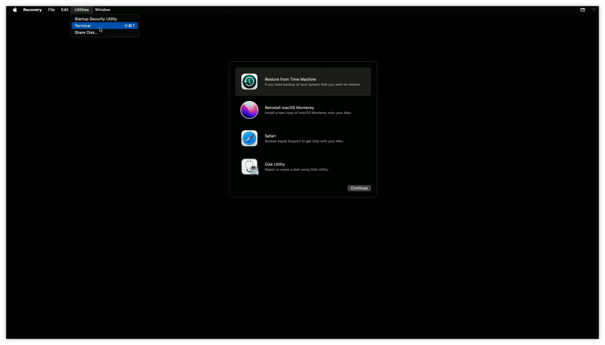
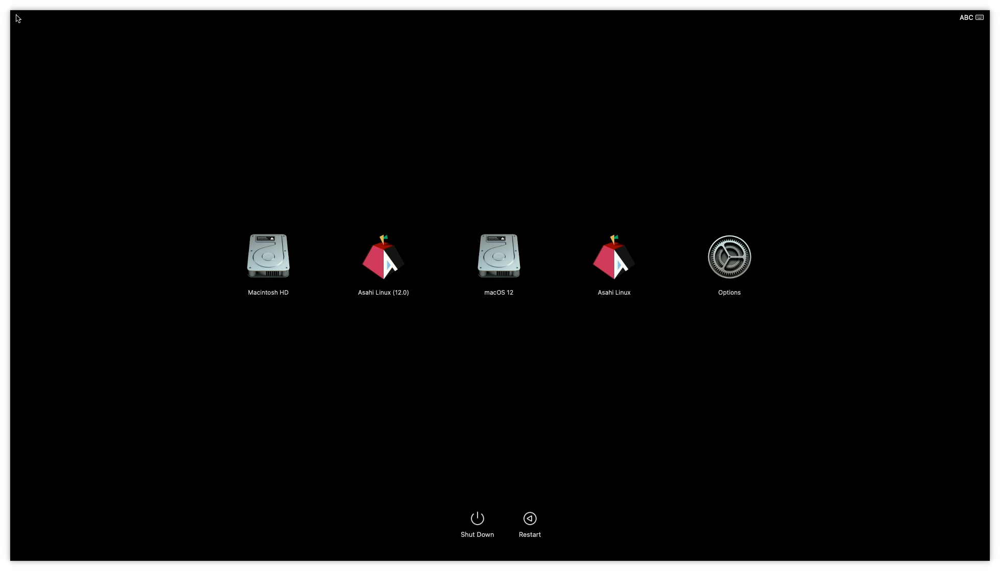

## Foreword

This document attempts to explain the Apple Silicon (i.e. M1 and later) Mac boot ecosystem (henceforth "AS Macs"), as it pertains for how open OSes interoperate with the platform.

It is intended for developers and maintainers of Linux, BSD and other OS distributions and boot-related components, as well as users interested in the platform, and its goal is to cover the overall picture without delving into excessive technical detail. Specifics should be left to other pages. It also omits details that only pertain to macOS (such as how kernel extensions work and how they are loaded).

The information here is based on how things work in system firmware and macOS versions 12.0 (Monterey) and later. A number of rapid design changes took place in the first year after the initial M1 Mac announcement; although older 11.x firmwares are usable, they are obsolete and buggy in various ways, and attempting to cover these changes would make things too confusing. We expect users wishing to run open OSes to run system firmware corresponding to macOS 12.1 or later, for practical reasons (though they may have older versions of macOS itself installed).

Please drop by #asahi on OFTC if you have general questions or feedback, or ping us on #asahi-dev if you are a developer and would like to discuss technical aspects ([further info](https://asahilinux.org/community/)).

## Design goals

AS Macs have the following design goals:

* Made for macOS
* Open to other OSes
* Mandatory secure boot (with user control)
* Secure even against attackers with physical access
* Resistant to supply-chain attacks
* Defense in depth (no blind trust in coprocessors/firmware)
* Native dual/multiboot with backwards compatibility
* Brick-proof
* Recoverable security (can be restored to known-good state by users)

Keep these design goals in mind as you read through this document, as they explain a lot of the decisions that went into the system architecture. Apple's approach to third-party OSes is essentially "have fun". We do not have any expectations of direct support, documentation, or additional development effort from them, nor do we expect them to attempt to hinder third-party OSes in any deliberate way. They have explicitly developed the ability to securely run third-party OSes and bootloaders on these machines, and left the rest to us.

Apple documents much of their security design in their [platform security guide](https://support.apple.com/guide/security/welcome/web), which should be considered the authoritative reference for these platforms. Nonetheless, the guide does not go into the fine technical points of the system, and we have learned about many further details through experimentation and reverse engineering.

These systems are engineered to run macOS, and make no explicit concessions for supporting other OSes; the ability to boot custom kernels can be viewed as official support for self-compiled builds of the [macOS kernel](https://github.com/apple-oss-distributions/xnu.git), and non-macOS OSes need to behave like macOS does as far as their interactions with the rest of the platform. In other words, the ABI specification for every aspect of boot and firmware interaction is "whatever macOS does". There is no attempt to enforce actual usage of macOS (no evil checks or anything of that sort), so the system is open to any OS as long as it follows the macOS boot ABI.

### On secure boot, user control, and licensing

It would be remiss not to briefly cover where these machines stand in terms of user control and trustability. Apple Silicon machines are designed first and foremost to provide a secure environment for typical end-users running macOS as signed by Apple; they prioritize user security against third-party attackers, but also attempt to limit Apple's own control over the machines in order to reduce their responsibility when faced with government requests, to some extent. In addition, the design preserves security even when a third-party OS is installed. The entire architecture is complicated and the details subtle, but to summarize a few key points:

* Boot components are signed and opaque (encrypted)
* Runtime components (e.g. firmware and macOS itself) are signed and transparent (plaintext)
    * With the exception of the SEP (Secure Enclave Processor, a TPM equivalent), which is optional and disabled by default
    * And two small blobs (SMC and PMU) which are merely incidentally encrypted; it would be nice to get Apple to disclose these, but they have a rather small I/O surface.
* Brick recovery / total system flash (DFU) requires phoning home
* Normal operation, including OS installs, can be performed off-line with physical user presence. It is possible to take an out-of-the-box Mac and install Linux on it without ever connecting it to a network.
* Owner control is asserted on first boot (you become machine owner by going through the macOS setup flow and creating the first admin user).
* The normal bootloader flow is minimal and has a small attack surface (no USB, network, etc.)
* No runtime blobs are designed to have total system access (no ME, no PSP, no TrustZone, nothing of that sort). Almost all blobs are running behind IOMMUs or similar firewalls, with the sole exception of the GPU firmware\*. All code running on the main CPUs is under the control of the OS.

This puts them somewhere between x86 PCs and a libre-first system like the [Talos II](https://www.raptorcs.com/TALOSII/) in terms of freedom to replace firmware and boot components; while a number of blobs are required in order to boot the system, none of those have the ability to take over the OS or compromise it post-boot (unlike, say, Intel ME and AMD PSP on recent systems, or the DMA-capable chips on the LPC bus running opaque blobs that exist on even [old ThinkPads](https://ryf.fsf.org/products/TET-X200)).

AS machines use a large number of auxiliary firmware blobs, each dedicated to a specific purpose and running on a separate CPU core. This is better than having a smaller number of kitchen sink blobs (like Intel ME), since each blob can only affect a particular subsystem (e.g. display, storage, camera), which makes it harder for multiple blobs to collude in order to compromise the user in a meaningful way. For example, the blob running inside the keyboard controller has no mechanism to communicate with the blob running on the WiFi card, and thus cannot implement a keylogger surreptitiously; the blob running on the display controller similarly has no way to communicate with the network, and thus can't implement a secret screen scraper.

From a security perspective, these machines may possibly qualify as the most secure general purpose computers available to the public which support third-party OSes, in terms of resistance to attack by non-owners. This is, of course, predicated on some level of trust in Apple, but some level of trust in the manufacturer is required for any system (there is no way to prove the non-existence of hardware backdoors on any machine, so this is not as much of a sticking point as it might initially seem).

This design does make it somewhat more awkward for users to install a third-party OS than we're used to on other platforms (this is standard fare in order to protect against malware and users being misled into compromising their machines), and this is covered in the rest of this guide.

On the licensing front:

* You *do* have to click through Apple's EULA in order to use the machines at all.
* Apple gives users explicit permission to run their own OS in their EULA.
* Apple does not give users permission to redistribute system firmware, but
* Apple provides all current and past versions of complete system images (firmware and macOS) on a well-known, unauthenticated HTTPS CDN, and
* Apple's EULA grants all Mac owners a license to use these images.

As with all EULAs, there are some nonsensical points in Apple's (lawyers always seem to be out of sync with actual product direction and design), but reading between the lines we believe everything we're doing is kosher for practical purposes.

\* There is one exceptional blob that does have privileged access to the system (although it does not explicitly do anything questionable): the GPU firmware. This is because it is in charge of managing parts of the GPU page tables (which are also its own), and there is no separate upstream IOMMU in front of the GPU coprocessor like there is with other coprocessors. While this does extend the surface of system compromise to it, it's worth pointing out that this firmware is not particularly large, is shipped in plain text and even with some symbols, does not have any functionality to talk via questionable interfaces (network, etc.), and is optional and not running when the OS boots (the OS must explicitly start it). Therefore, users willing to forgo GPU functionality can choose not to use it. The firmware also implements a mitigation similar to the [PPL](http://newosxbook.com/articles/CasaDePPL.html) in order to protect the GPU page tables even if it is compromised via exploitation (e.g. through GPU commands), ~~although we do not believe this mechanism is currently hardened enough to be an effective mitigation; we look forward to further auditing the GPU firmware and hope Apple will work with us on issues found, so that we can reach a point where we can confidently say that it would be difficult or impossible to use a runtime vulnerability in it to escalate to full system memory access~~. Update: As of macOS 13.0, the GPU firmware is significantly hardened (in part thanks to Lina's discovery and report of CVE-2022-32947). ~~We are not yet shipping 13.0+ firmware for Asahi, but we will soon~~ Asahi now ships with firmware 13.5, which significantly increases our confidence in this part of the system. Nonetheless, at this time, we have no reason to believe that there are any backdoors in the existing 12.3/12.4 firmwares we use, or that exploiting them is possible from Linux.

## Storage

AS platforms have two main kinds of storage: NOR Flash and NVMe.

NOR is formatted as raw regions and contains:

* 1st stage bootloader (iBoot1/LLB)
* System-global firmware
* Platform configuration data (syscfg, read-only)
* Factory test logs
* NVRAM (config variables, read-write)

NVMe is a GPT volume and contains:

* System-global storage (iBoot System Container; iSC) including:
    * Boot policies (think boot configs, but secure) (Preboot)
    * SEP secure storage (xARTS)
    * Misc system config data
* One or more APFS container partitions
    * Each containing one or more bootable OSes sharing a container, each comprising
        * Preboot volume subfolder
            * 2nd stage bootloader (iBoot2)
            * Apple Device Tree
            * OS-paired firmware
            * OS kernel (XNU)
        * OS-paired recoveryOS image (in Recovery volume)
        * Per-OS root & data filesystem volumes (may be empty)
* System-global recoveryOS image (+ optional fallback)

There are no restrictions on additional partitions and types; they are ignored by Apple's tooling.

Note that the system does not use an EFI system partition (and does not run EFI). OS selection is designed around APFS containers and subvolumes containing files in a specific layout.

AS Macs are designed to be brick-proof. They can be recovered from another machine by using a USB cable and booting from ROM, even if all NOR and NVMe contents are destroyed (\* NOR destruction untested). This is [officially documented](https://support.apple.com/en-us/108900) using another Mac. We have alternative [open source tooling](https://github.com/libimobiledevice/idevicerestore) for this that works on Linux/etc.

One notable point of this design is that each installed OS also brings along with it a large subset of system firmware running on coprocessors, as well as the OS loader. This makes it easier to maintain backwards compatibility with older OSes; conversely, it also means the firmware ABI for these coprocessors has no stability guarantees whatsoever.

Terminology note: "OS kernel" here refers to a XNU kernel image, or an equivalent analog. In this section, we use this term to describe anything loaded by iBoot2. When booting third-party OSes, this would normally be a subsequent bootloader stage, such as [m1n1](https://github.com/AsahiLinux/m1n1).

## Boot flow

The platform-mandated boot flow can be summarized as follows:

* SecureROM:
    * Reads/validates iBoot1 from NOR
    * Enters USB DFU mode on failure
* iBoot1:
    * Reads/validates system-global firmware from NOR
    * Bootstraps some coprocessors
    * Shows the Apple logo and plays the boot chime
    * Picks and validates a boot policy
    * Reads/validates iBoot2 from the chosen OS container on NVMe
* iBoot2:
    * Reads/validates OS-paired firmware from NVMe
    * Loads and locks some of that firmware, re-bootstraps display coprocessor
    * Reads/validates the Apple Device Tree from NVMe
    * Reads/validates the OS kernel from NVMe
    * Puts some coprocessors to sleep
    * Jumps to OS kernel

The OS kernel is the first point in the boot flow where we can run non-Apple-signed code.

Notably, at no point in this process is any I/O initialized other than the screen, the speakers, and checking for power button presses or (on laptops) specific keys. There is *no* external storage boot support in the bootloader flow on these machines. Behind the scenes, booting macOS from an external drive involves the moral equivalent of copying `/boot` to internal storage, and only the root/data filesystems truly live on external storage. There is also no boot menu (but keep reading).

## recoveryOS and 1TR

recoveryOS is a macOS image that is used to provide an environment for users to perform recovery and installation tasks on these machines. In addition, it also serves as the boot picker menu on these machines.

recoveryOS can be requested via NVRAM variables on reboot, or can automatically be invoked after a certain number of boot failures. It is a minimal macOS image that presents the user with a recovery menu that allows them to change system security settings, partition disks, launch a web browser, launch a root terminal, reinstall macOS, etc. Network access is supported.

In addition, there is a "special" boot flow that grants additional capabilities. When the user powers up the machine by holding down the power button, this loads the recoveryOS paired with the currently active default boot OS volume (falling back to the system one), and first shows a boot picker to allow the user to choose an OS to boot (and optionally make the default):

If the user chooses "Options", they will be presented with the recoveryOS menu, as above. When booted this way, it is called "One True recoveryOS" (1TR), and it has additional powers granted to it by SEP (secure enclave) firmware. Additionally, this recoveryOS will be considered "paired" with the OS container it belongs to, and be able to perform specific operations on that OS. In particular, this mode is required in order to install a custom OS kernel.

## SEP (Secure Enclave Processor)

The SEP is the Mac's equivalent of a TPM, and is in charge of all security-critical operations such as validating the creation and modification of Boot Policies. It has knowledge of the security state of the system, including whether it is in 1TR, plain recoveryOS, or regular OS boot.

The SEP is used during the boot process, but is put to sleep before the OS kernel is booted. The OS must re-load the SEP firmware and re-bootstrap it to be able to use it (the encrypted firmware blob is provided in a memory region to the OS by iBoot). This means that the SEP is completely optional for a third-party OS, and can be ignored if not needed nor desired.

Useful features provided by the SEP include user authentication, Touch ID, secure key storage / usage, U2F support, etc. For example, it can be used to provide bruteforce-resistant password/touch login and full disk encryption, or to hold SSH keys and require a password or touch to use them.

The SEP is designed to be mutually isolated from the main CPU (AP); neither can compromise the other. It is supposedly also hardened against physical attacks (e.g. glitching and other environmental attacks).

## Security modes, Boot Policies, and machine ownership

Each installed OS on an AS Mac has an associated Boot Policy. The Boot Policy describes the security state of the OS. These Boot Policies are created via the SEP and signed by an internal machine key, so they cannot be modified externally.

The top-level security mode can be in one of three states per OS:

* Full Security
* Reduced Security
* Permissive security

Full Security is the default, and implies that the OS is fully Apple-signed and all security features are enabled. In order to install an OS in Full Security mode, the system must phone home to Apple to validate that the OS is trustworthy (this prevents attackers from installing a known vulnerable, old OS and using it to compromise the system).

Reduced Security allows for certain security features to be disabled, and any Apple-signed OS version to be installed. No phoning home is required to install an OS in this mode, but downgrading or creating a Boot Policy to this mode requires being in recoveryOS and authenticating using machine owner credentials.

Permissive Security allows for ~all security features to be disabled, and third-party kernels to be installed. No phoning home is required. Downgrading to Permissive Security requires booting in 1TR paired to the specific OS involved, and authenticating using machine owner credentials.

The SEP maintains a database of machine owner users. The first such user is created when the user goes through the macOS boot flow on first startup from a factory-fresh state (or after a full DFU wipe). Subsequent machine owners can only be created by authenticating with an existing owner's credentials.

The ability to have a security state per OS is unique to these machines, and allows for things like dual-booting a full-secure macOS (including DRM support, i.e. Netflix in 4K and running iOS apps) and Linux (contrast this to unlocking the bootloader on an Android device or disabling secure boot or changing the signing keys on a UEFI system, which are global operations).

Lower security levels unlock the ability to specify finer-grained security settings in the Boot Policy, such as whether OS boot-args filtering will take place and whether the kernel code will be locked read-only in RAM.

Boot policies can be managed using the `bputil` command from macOS/recoveryOS/1TR (subject to the restrictions of each mode).

## Fully Untrusted OS (fuOS)

fuOS is Apple's term for a third-party OS kernel. In order to configure fuOS boot, an existing OS has to first be downgraded to Permissive Security, and then a custom kernel image can be installed. The image is installed using the `kmutil` command and it will modify the Boot Policy to insert its hash into it, thereby preserving the secure boot chain. iBoot2 will only load this specific fuOS image; replacing or upgrading it requires booting into 1TR and running `kmutil` again. This operation requires machine owner credentials.

Custom kernel images can be flat ARM64 executable images; the entrypoint and (virtual; mostly meaningless) load address are specified when the image is configured. Previously Mach-O binaries were required, but it seems Apple added this feature in 12.1 in order to make life easier for us (as the Mach-O file format requirements changed in that version, breaking our existing tooling).

## Boot Picker

The built-in boot picker is a macOS application running under recoveryOS, and it scans internal and external volumes for bootable OSes. There are two things that can show up on the list: OS installs, and OS installers. OS installs exist in APFS containers following the expected OS layout (multiple OSes can be present in one APFS container).

Since iBoot has no mechanism for booting from external devices, upon selecting an external OS to boot, the boot picker will copy that OS's Preboot structure into NVMe, create a Boot Policy for it, and then configure iBoot1 to boot from that instead. The copied parts include everything up to the XNU kernel itself, including iBoot2 and firmware. This means that external storage is only initialized once XNU is already running, and it will merely mount its root filesystem from there, having been booted from NVMe. Note that, since this process requires the creation of a new Boot Policy (that will not be in the appropriate security state, nor can it be put into it at that point due to pairing requirements), it cannot be used to boot fuOS kernels installed on external drives in this manner (at least not without further manual action, but it's unclear whether this would be possible at all).

OS installers are identified by a magic `.IAPhysicalMedia` plist at the root of the volume, and may exist on volumes of any supported filesystem (APFS and FAT32 both work). That plist specifies a macOS application bundle present in the volume to launch. When the volume is selected, boot proceeds into the main recoveryOS environment (including authentication mandated by FileVault, if enabled), and then automatically launches the application bundle. This happens in 1TR mode if the boot picker was invoked via the appropriate power button hold gesture. This feature is currently used in the Asahi Linux installer to launch its second stage in a more user-friendly manner, and could be used to ship third-party installers as USB install images (but not ones usable as-is completely offline, as they would still require non-redistributable Apple components).

One consequence of the boot picker being implemented as a macOS application behind the scenes is that is has full accessibility support (including VoiceOver), which is rather unique.

## ARM64 XNU boot protocol

The boot protocol is fairly simple; there are no bootloader services (e.g. EFI services) or anything of that sort. The OS image is loaded and jumped to by iBoot. The kernel image receives the following information, via various pointer chains:

* Boot-time framebuffer information (incl. verbose boot flag)
* Command line arguments (`boot-args` from NVRAM), filtered by Boot Policy flag
* RAM base/size info
* Apple Device Tree
* SEP firmware blob

Images are always loaded at a randomized offset in low RAM (KASLR), so they must be relocatable. Image text is optionally locked as read-only in the memory controller, for security reasons. In addition, the CPU0 reset vector is locked at a computed offset within the image, so resuming from sleep mode requires code to be present at that address.

## Apple Device Tree

Apple uses a bespoke Device Tree format (simpler than FDT), with a similar data model to the Open Firmware device trees that are standard in embedded Linux/BSD systems. The device tree is built by iBoot2 from a template, system configuration information, and dynamic data. The schema for the device tree is not strictly stable from OS version to OS version, but major changes are rare.

OSes must parse the ADT to extract vital machine- and boot-specific information.

## Firmware overview

Brief overview of known firmware blobs (note: some details here are unverified):

| Name     | Chip     | Description                         | Encrypted | Storage            | Loaded by    | Started by  | Size (approx.)            |
| -------- | -------- | ----------------------------------- | --------- | ------------------ | ------------ | ----------- | ------------------------- | 
| iBoot1   | SoC (AP) | First stage bootloader              | No \*2   | NOR                | SecureROM    | SecureROM   | ~600-1000 KB (comp.)
| iBoot2   | SoC (AP) | Second stage bootloader             | No \*2   | Preboot            | iBoot1       | iBoot1      | ~450-800 KB (comp.)
| SMC      | SoC\*1   | System Management Controller        | No \*2   | Embedded in iBoot1 | iBoot1       | iBoot1      | ~200 KB (comp.)
| PMU      | PMU      | Power Management Unit               | No \*2   | Embedded in iBoot1 | iBoot1       | iBoot1      | ~10 KB
| SEP      | SoC      | Secure Enclave Processor            | Yes       | iSC                | iBoot1+OS    | iBoot1+OS   | ~7.5 MB
| ANS      | SoC      | NVMe controller                     | No        | NOR                | iBoot1       | iBoot1+2+OS | ~800 KB (comp.)
| CIO      | SoC      | Type-C/Thunderbolt I/O              | No        | NOR                | iBoot1       | OS          | ~170 KB
| TMU      | SoC      | Thunderbolt related                 | No        | NOR                | iBoot1       | OS          | ~10 KB
| DCP      | SoC      | Display Controller Processor        | No        | NOR & Preboot      | iBoot1+2     | iBoot1+2+OS | ~9.5 MB (~2.5 MB comp.)
| ANE      | SoC      | Apple Neural Engine                 | No        | Preboot            | iBoot2       | OS          | ~5 MB (~180 KB comp.)
| AGX      | SoC      | Apple Graphics (GPU)                | No        | Preboot            | iBoot2       | OS          | ~2.5 MB (~150 KB comp.)
| ISP      | SoC      | Image Signal Processor (Camera) \*3 | No        | Preboot            | iBoot2       | OS          | ~12 MB (~2.5 MB comp.)
| SIO      | SoC      | Smart I/O (UART/I2C/SPI DMA)        | No        | Preboot            | iBoot2       | OS          | ~1 MB (~50 KB comp.)
| AOP      | SoC      | Always-On Processor \*4             | No        | Preboot            | iBoot2       | OS          | ~1.2 MB (~300 KB comp.)
| PMP      | SoC      | Power Measurement Processor         | No        | Preboot            | iBoot2       | OS          | ~400-920 KB (~100 KB comp.)
| AVE      | SoC      | Apple Video Encoder                 | No        | Preboot            | iBoot2       | OS          | ~1.2 MB (~300 KB comp.)
| AVD      | SoC      | Apple Video Decoder                 | No        | Embedded in XNU    | OS           | OS          | ~40 KB
| SECDIS   | SECDIS   | Secure Mic/Cam Disable FPGA \*5     | No        | On-chip flash      | Self         | Self        | Not upgradable by design
| IPD      | IPD      | InputDevice (Touchpad/Keyboard) \*5 | No        | Preboot/Flash \*6  | Self         | Self        | ~900 KB (~384 KB comp.)
| MT       | DFR      | Touch Bar (DFR) Multitouch \*7      | No        | Preboot            | OS           | OS          | ~60 KB
| XHCI     | ASM3142  | PCI xHCI USB controller \*8         | No        | Embedded in XNU    | OS           | OS          | ~128 KB
| WLAN     | WLBT     | Wi-Fi (Broadcom FullMAC)            | No        | OS filesystem      | OS           | OS          | ~1.4 MB (~700 KB comp.)
| BT       | WLBT     | Bluetooth (Broadcom)                | No        | OS filesystem      | OS           | OS          | ~470 KB (~280 KB comp.)
| SE       | SE       | Secure Element                      | Yes       | On-chip flash      | Self         | Self / SEP? | ~4.5 MB
| S5E      | S5E      | NAND (SSD) Controller               | No        | On-chip flash      | On-chip ROM? | ANS         | ~700 KB (~300 KB comp.)
| ACE2     | ACE2     | USB-PD Controller                   | No        | Dedicated flash    | On-chip ROM  | OS?         | ~500 KB (~170 KB comp.)
| TCON     | TCON     | Display Timing Controller \*9       | No        | On-chip flash      | Self         | DCP         | ~1.3 MB (~20 KB comp.)
| DP2HDMI  | MCDP29XX | DisplayPort to HDMI bridge \*10     | No        | Dedicated flash    | Self         | DCP         | ~500 KB (~280 KB comp.)

Notes:

1. "SoC" location means part of the main System-on-Chip; otherwise it is an external chip.
2. Plaintext since macOS Sequoia.
3. Coprocessor is present but unused on machines without a camera.
4. Terrible name, not actually always-on (not even on when the OS boots).
5. Laptops only
6. Boots from Flash, but firmware lives in Preboot and is upgraded by OS FUD daemon if necessary
7. J293 only (MBP 13" M1)
8. J456 (4-port iMac) only
9. Machines with embedded display only
10. Machines with HDMI port only

Many firmware sizes are compressed (many firmwares have large amounts of padding, making uncompressed sizes not very useful to gauge how much code there is). Where large firmwares are stored uncompressed, compressed sizes are also given for better comparison. The sizes should be taken as a rough guide only.
