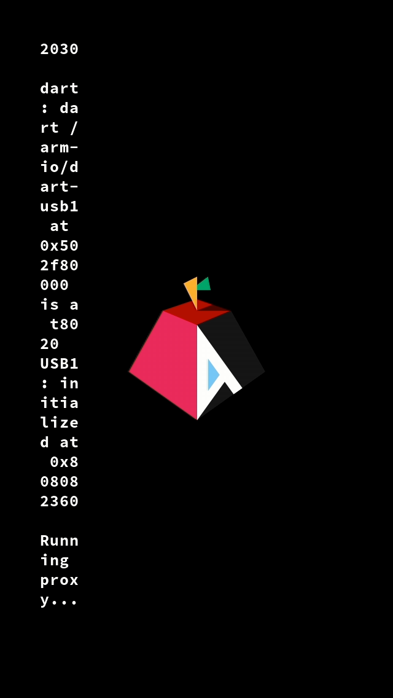

A list of random fun trivia about this platform and its legacy.

# iPhone legacy
## My M1 thinks it's an iPhone 5

When an M1 Mac Mini is booted without a display connected, or unconditionally as of macOS 12.0, iBoot does not initialize the display. Instead it creates fake 640×1136 framebuffer. That's the screen resolution of the iPhone 5.

Then this happens:

## Just can't let go of Samsung

The serial port peripheral in the M1 is ~identical to the one in the original iPhone SoC by Samsung (S5L8900), to the point where we use the same Samsung UART driver in Linux. We don't know if these days it's a re-implementation by Apple, or if they're still licensing the same old Samsung IP.

In fact, the idea that the Apple A4 was the first "in-house" design by Apple is primarily marketing. Apple SoCs have been leading a slow transition away from third-party IP to Apple IP, but they still use plenty of third-party blocks. There is no clear line between third-party and in-house design.

# PowerPC legacy

## HIDden registers

Apple CPU cores call their miscellaneous configuration/[chicken bit](https://en.wiktionary.org/wiki/chicken_bit) registers "HIDx" registers, meaning "Hardware Implementation Dependent" register. This name was first used by IBM in their PowerPC CPUs for the same purpose.

## DARTing back to the Power Mac G5

The IOMMUs in Apple SoCs are called "DART"s. This stands for "Device Address Resolution Table", which was also the name of the IOMMU in the U3H host bridge in Power Mac G5 systems. The actual details are unrelated, though, so there is no shared code for this; only the name is the same.

## What do an AmigaOne X1000 and an M1 Mac have in common?

The I²C peripheral in the M1 and other recent Apple SoCs is a modified version of the I²C peripheral in the PWRficient PA6T-1682M chip from P. A. Semi. Apple bought the company to kickstart their SoC/CPU design team, and decided that one IP block was good enough to just keep. This is the same CPU that is used in the AmigaOne X1000, and we extended the existing Linux driver to support both platforms.

# x86 legacy

## My M1 natively runs x86 code

The DisplayPort to HDMI bridge chip in the Mac Mini and 14"/16" MacBook Pros (MDCP29xx) uses a V186 CPU core. That's an Intel 80186 clone, running good old 16-bit x86 real mode code. Yes, x86 from the MS-DOS era is in your Mac.

# Attention to detail

## Help me!

The Mac’s [SecureROM](../fw/boot.md#stage-0-securerom) is small and can’t do much by itself; on the Mac mini, it cannot display an image on the screen. It can, however, control the power LED.
If you start the Mac in [DFU mode](glossary.md#d), the LED will be amber instead of white.
If you start the Mac normally and the early boot process fails (for instance, because of a failed restore operation), the power LED will be amber, and blink with the following pattern: three short blinks, three longer blinks, three shorts blinks, a pause, and repeat. That is [Morse code for SOS](https://en.wikipedia.org/wiki/Morse_code#Applications_for_the_general_public)! The Mac is quietly asking to be saved…

